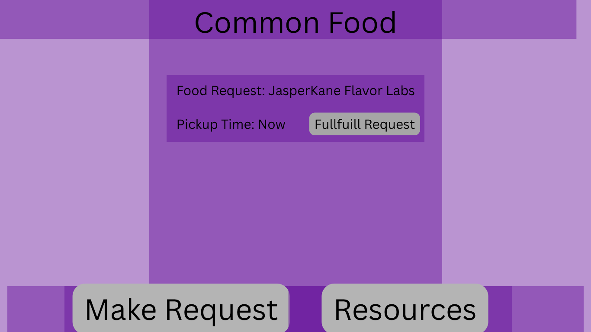
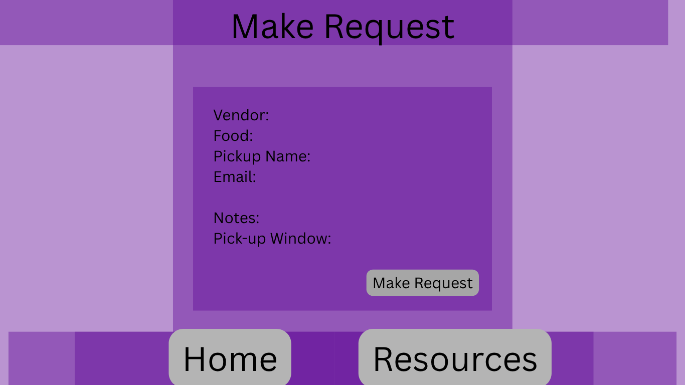
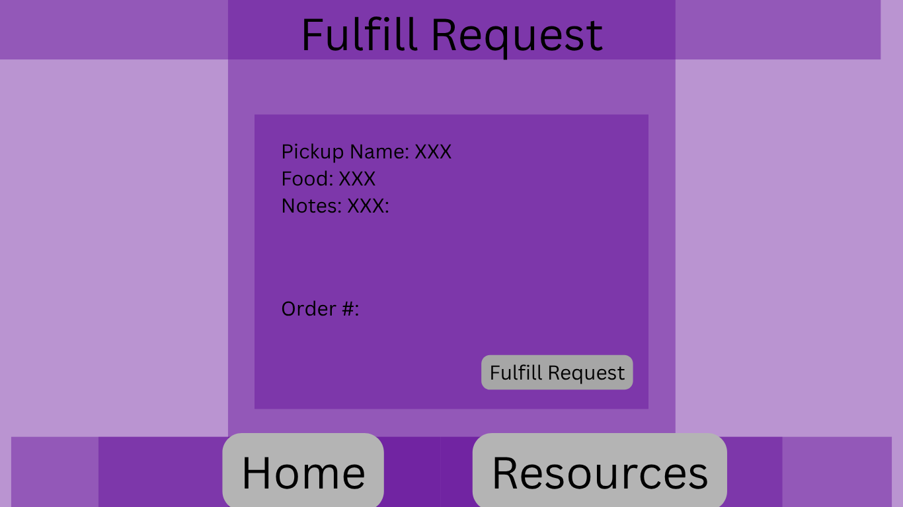
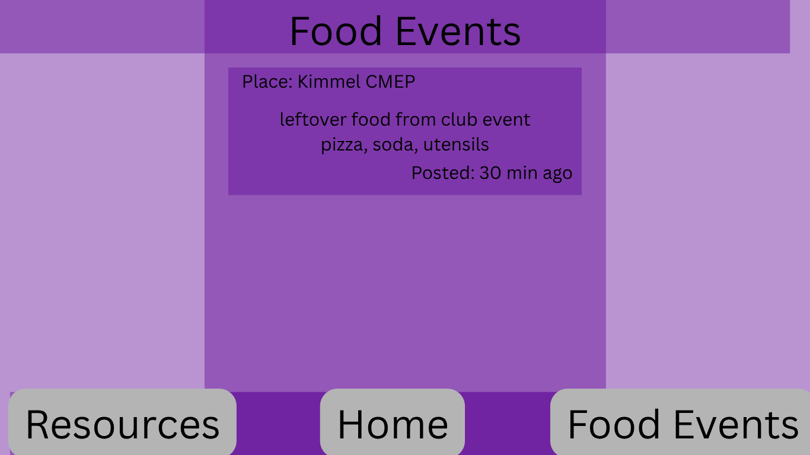
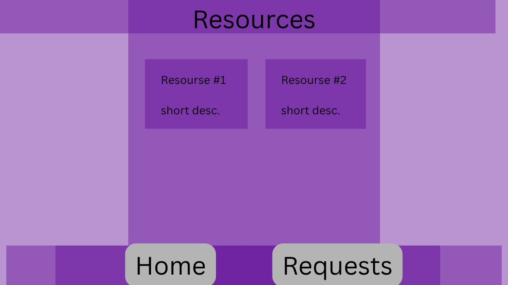

# CommonPlate

## Overview

CommonPlate @ NYU is a web app that helps students share extra meal swipes or food events with others.
Students who need a meal can post a short request that includes where they want food from, what they want, a pickup name, and a time window.
Students who have extra meal swipes can look at the list of requests, pick one, place the order, and mark it as fulfilled.

There’s also a small section for posting free-food events on campus (for example, “pizza in Kimmel, 6 PM”).
All requests and events disappear automatically after a set time, keeping everything simple and private.


## Data Model

The site will store Requests, Fulfillments, and Events.

Each Request can have one Fulfillment when someone orders it.

Events are posted separately and automatically delete two hours after their start time.


Example Request:

```javascript
{
  vendor: "Flavor Labs",
  food: "Chicken bowl",
  pickupName: "Faith",
  pickupWindow: "5 – 8 PM",
  email: "faith@example.com",
  status: "requested",
  createdAt: Date
}
```

Example Fulfillment:

```javascript
{
  requestId: ObjectId,   // links to a Request
  orderNumber: "23847",
  eta: "5:45 PM",
  placedAt: Date
}
```

Example Event:
```javascript
{
  where: "Kimmel Center",
  when: "2025-11-09T18:00:00",
  foodType: "Pizza",
  notes: "Open to everyone",
  createdAt: Date
}
```

## [Database Schema](models/db.mjs) 

## Wireframes

/ (Home) – shows current meal requests and events, with buttons for "New Request" and "Post Food Event."



/request/new – form for adding a meal request.



/request/:id/fulfill – page where a giver enters the order number and ETA.



/events/new – form to post a food event.



/resources - a page connecting to nyu resources for food insecurity



## Site map

```
Home
 ├── New Request
 ├── Fulfill Request
 ├── Post Food Event
 └── Resources (links to NYU + NYC food programs)
```

## User Stories or Use Cases

As a student, I can submit a new meal request with vendor, food, pickup name, time window, and my email.

As a student with leftover meal swipes, I can see open requests and mark one as fulfilled by entering an order number and ETA.

As any user, I can post a food event with where, when, and type of food.

As a requester, I get one confirmation email and one fulfillment email.

As the system, all data older than 24 hours (requests) or 2 hours (events) is deleted automatically.

## Research Topics

| Topic                             | Points                                                                  | Description |
| --------------------------------- | ----------------------------------------------------------------------- | ----------- |
| **(2 pts)** TypeScript            | Convert entire codebase to TypeScript for type safety.                  | Adds compile-time type checking to prevent errors in both server and client code. |
| **(3 pts)** Email API integration | Use Resend to send confirmation and fulfillment emails from the server. | Automates email notifications when requests are created and fulfilled. |
| **(2 pts)** Express Rate Limiting | Protects request/event forms from spam.                                 | Prevents abuse by limiting how many requests can be made from one IP. |
| **(3 pts)** node-cron + TTL       | Runs jobs that delete expired requests and events automatically.        | Combines MongoDB TTL indexes with node-cron backup for reliable data cleanup. |

**Total: 10 points**


## [Link to Initial Main Project File](app.mjs) 


## Annotations / References Used

1. **TypeScript** — type-safe JavaScript for both server and client code.
   [https://www.typescriptlang.org/docs/](https://www.typescriptlang.org/docs/)

2. **MongoDB TTL Indexes** — auto-delete Requests (24h) and Events (~2h).
   [https://www.mongodb.com/docs/manual/core/index-ttl/](https://www.mongodb.com/docs/manual/core/index-ttl/)

3. **node-cron** — simple scheduled jobs (if needed in addition to TTL).
   [https://github.com/node-cron/node-cron](https://github.com/node-cron/node-cron)

4. **express-rate-limit** — basic spam protection on form endpoints.
   [https://www.npmjs.com/package/express-rate-limit](https://www.npmjs.com/package/express-rate-limit)

5. **Resend (email API)** — send confirmation and fulfillment emails.
   [https://resend.com/docs](https://resend.com/docs)

6. **esbuild** — fast TypeScript bundler for client-side code.
   [https://esbuild.github.io/](https://esbuild.github.io/)

7. **dotenv** — load env vars like `MONGO_URI` and API keys.
   [https://github.com/motdotla/dotenv](https://github.com/motdotla/dotenv)
